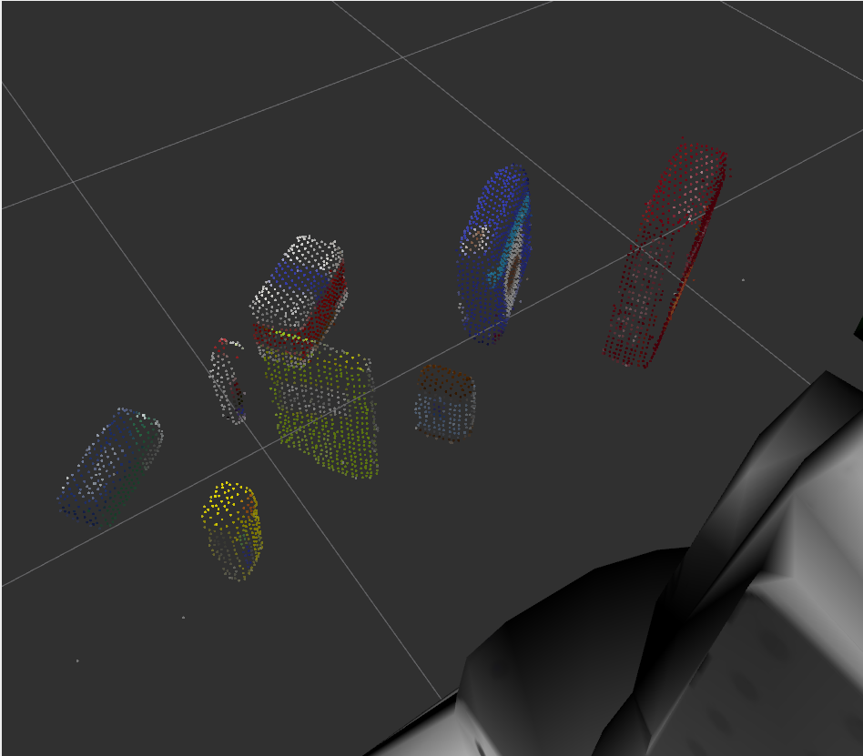
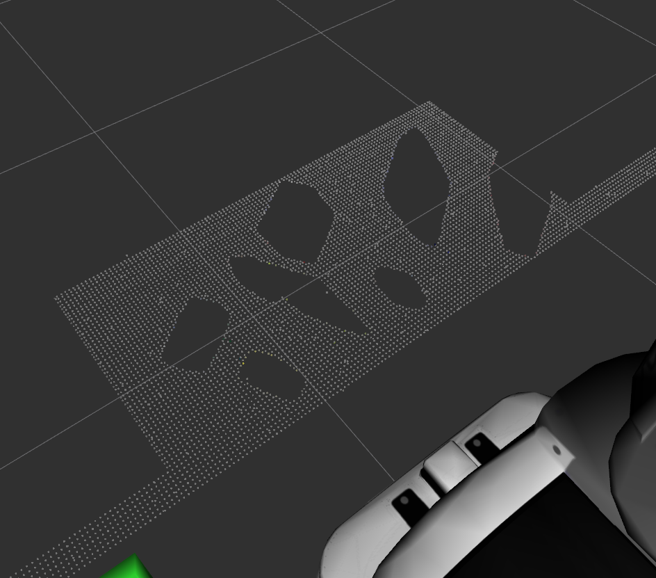
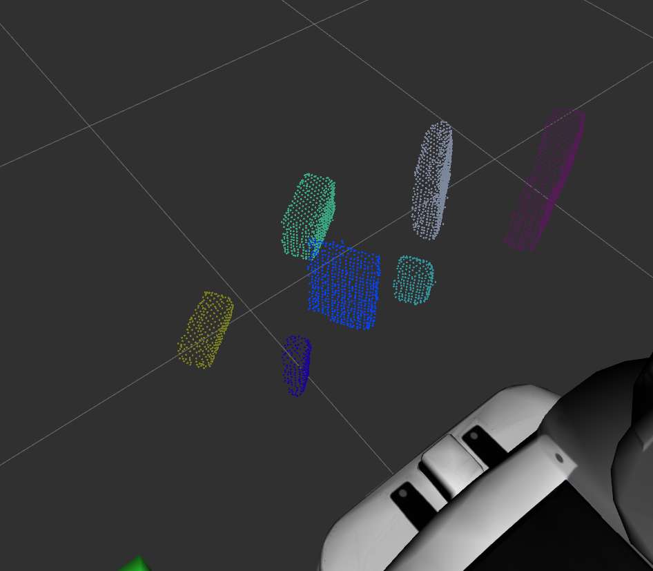
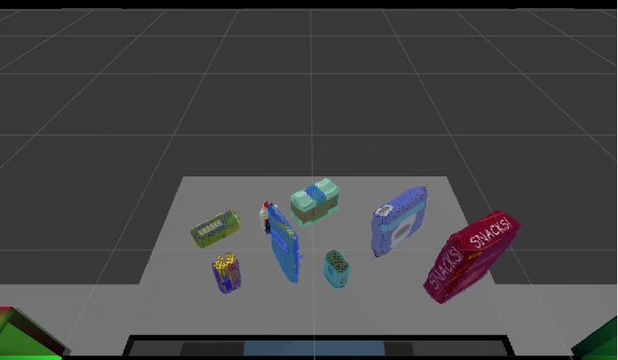
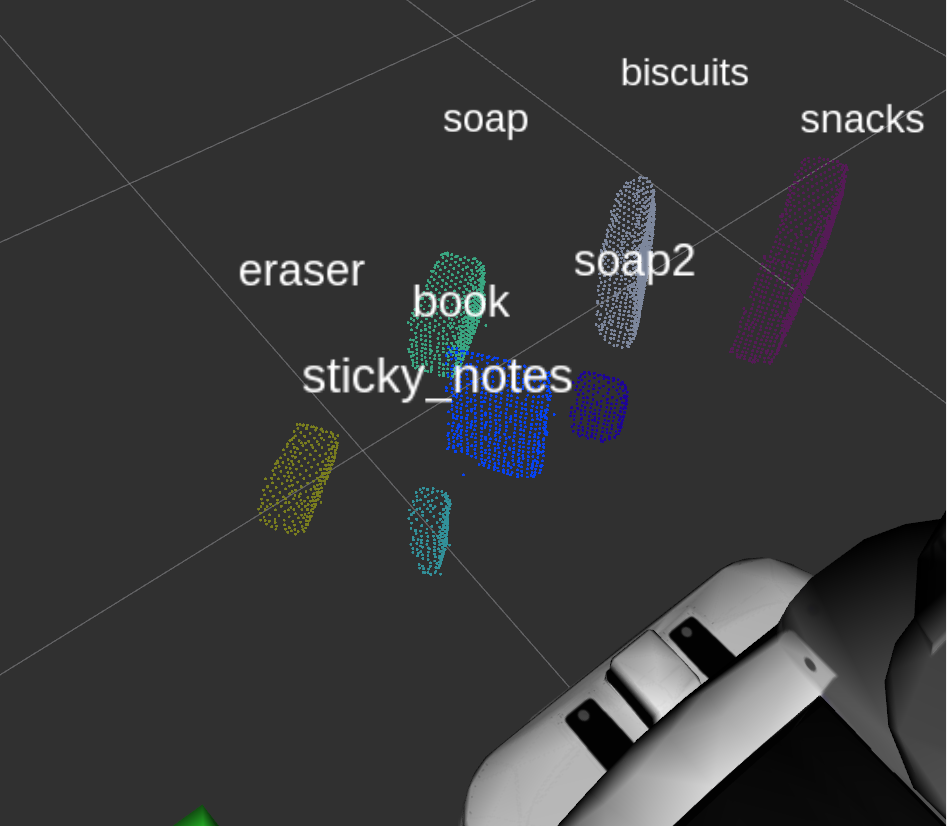
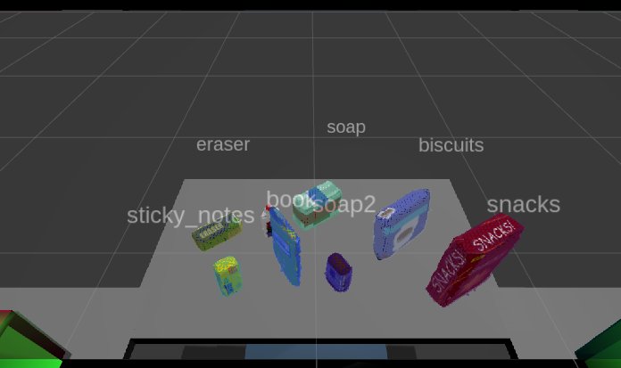
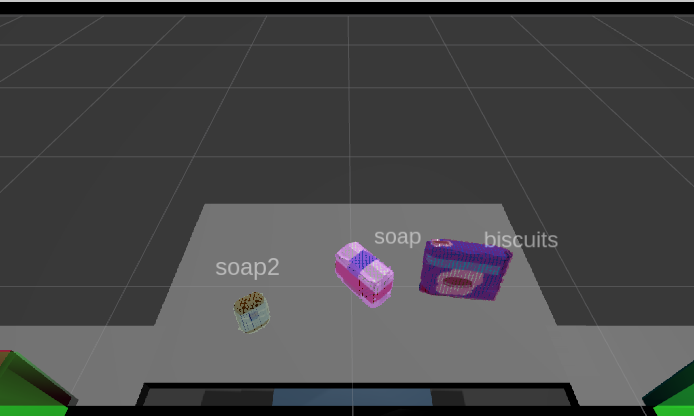
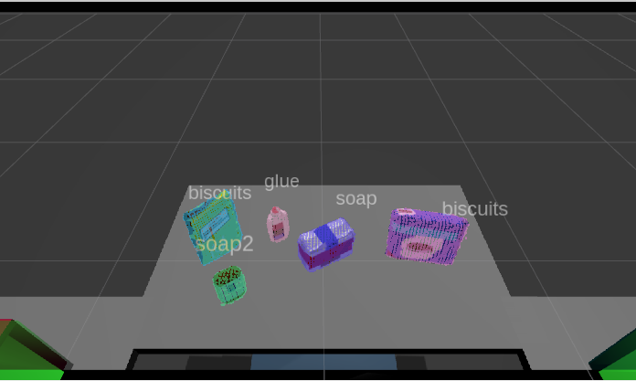
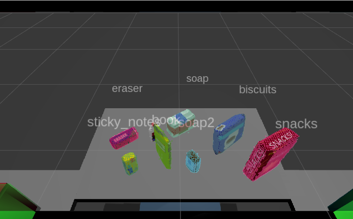

## Project: Perception Pick & Place
### Writeup Template: You can use this file as a template for your writeup if you want to submit it as a markdown file, but feel free to use some other method and submit a pdf if you prefer.

---

# Required Steps for a Passing Submission:
1. Extract features and train an SVM model on new objects (see `pick_list_*.yaml` in `/pr2_robot/config/` for the list of models you'll be trying to identify). 
2. Write a ROS node and subscribe to `/pr2/world/points` topic. This topic contains noisy point cloud data that you must work with.
3. Use filtering and RANSAC plane fitting to isolate the objects of interest from the rest of the scene.
4. Apply Euclidean clustering to create separate clusters for individual items.
5. Perform object recognition on these objects and assign them labels (markers in RViz).
6. Calculate the centroid (average in x, y and z) of the set of points belonging to that each object.
7. Create ROS messages containing the details of each object (name, pick_pose, etc.) and write these messages out to `.yaml` files, one for each of the 3 scenarios (`test1-3.world` in `/pr2_robot/worlds/`).  [See the example `output.yaml` for details on what the output should look like.](https://github.com/udacity/RoboND-Perception-Project/blob/master/pr2_robot/config/output.yaml)  
8. Submit a link to your GitHub repo for the project or the Python code for your perception pipeline and your output `.yaml` files (3 `.yaml` files, one for each test world).  You must have correctly identified 100% of objects from `pick_list_1.yaml` for `test1.world`, 80% of items from `pick_list_2.yaml` for `test2.world` and 75% of items from `pick_list_3.yaml` in `test3.world`.
9. Congratulations!  Your Done!

# Extra Challenges: Complete the Pick & Place `TODO`
7. To create a collision map, publish a point cloud to the `/pr2/3d_map/points` topic and make sure you change the `point_cloud_topic` to `/pr2/3d_map/points` in `sensors.yaml` in the `/pr2_robot/config/` directory. This topic is read by Moveit!, which uses this point cloud input to generate a collision map, allowing the robot to plan its trajectory.  Keep in mind that later when you go to pick up an object, you must first remove it from this point cloud so it is removed from the collision map!
8. Rotate the robot to generate collision map of table sides. This can be accomplished by publishing joint angle value(in radians) to `/pr2/world_joint_controller/command`
9. Rotate the robot back to its original state.
10. Create a ROS Client for the “pick_place_routine” rosservice.  In the required steps above, you already created the messages you need to use this service. Checkout the [PickPlace.srv](https://github.com/udacity/RoboND-Perception-Project/tree/master/pr2_robot/srv) file to find out what arguments you must pass to this service.
11. If everything was done correctly, when you pass the appropriate messages to the `pick_place_routine` service, the selected arm will perform pick and place operation and display trajectory in the RViz window
12. Place all the objects from your pick list in their respective dropoff box and you have completed the challenge!
13. Looking for a bigger challenge?  Load up the `challenge.world` scenario and see if you can get your perception pipeline working there!

## [Rubric](https://review.udacity.com/#!/rubrics/1067/view) Points
### Here I will consider the rubric points individually and describe how I addressed each point in my implementation.  

---

## [View 3d_perception.py Implementation](./catkin_ws/src/RoboND-Perception-Project/pr2_robot/scripts/3d_perception.py)

### Exercise 1, 2 and 3 pipeline implemented
#### 1. Complete Exercise 1 steps. Pipeline for filtering and RANSAC plane fitting implemented.

Statistical Outlier Filtering method was used to clean the point cloud data from outlier noise

Pass-Through Filtering method was used to separate the table from the objects. In addition, the drop boxes on the sides were also being included in the camera input, hence the axes that needs filtering are both x and z axes. If this is not done, the drop boxes will be clustered and falsely identified

Random Sampling Consessus for a Plane was used to separate

#### 2. Complete Exercise 2 steps: Pipeline including clustering for segmentation implemented.

For clustering and object segmentation, the DBSCAN algorithm was used. Using PCL's Euclidean Cluster Extraction function, we used a kd-tree data structure for the point cloud data to find the nearest neighbor. The algorithm uses the values of tolerance, minimum cluster size and maximum cluster size to determine the groupings of the clusters. Tolerance determines how objects are clumped into clusters. Minimum and maximum cluster size determines the required and maximum cluster size of a specific group.

#### 3. Complete Exercise 3 Steps.  Features extracted and SVM trained.  Object recognition implemented.

For Object recognition, we used extracted features from different objects used in the project. We retrieved Hue, Saturation and Value histograms as well as the normal (normal vector to the plane/surface) to create the object's feature, labeling them accordingly.

Then we used a Support Vector Machine as our classifier, and trained this model using the features we generated. This SVM was used to recognize the objects in the test worlds

### Pick and Place Setup

#### 1. For all three tabletop setups (`test*.world`), perform object recognition, then read in respective pick list (`pick_list_*.yaml`). Next construct the messages that would comprise a valid `PickPlace` request output them to `.yaml` format.

1. **Implementation**
   
   * Since the point cloud data that will be used this time would also contain noise, statistical outlier filter was added to the exercise-1 steps

   * The difference between the exercise world and the project world required tweaking in the pass through filter to exclude the drop boxes that comes into view, and the difference in table dimensions. Pass through filtering through the x-axis was also added to exclude the peeping dropboxes in the view.

   * There were times when the SVM mislabels a certain object. There was really no way for the SVM to confirm if it labeled an item correctly unless a person sees the wrong label. However, I added code that prevents two identically identified objects to be put into the yaml file to be included, hencing having two identical objects in the yaml is prevented. However this does not guarantee object recognition correctness.

2. **Results**

   * In world 1, all three items were labeled correctly

### [Test World 1 YAML file](./catkin_ws/src/RoboND-Perception-Project/pr2_robot/scripts/test_world_1.yaml)

   * In world 2, the book was being mis labeled as biscuits

### [Test World 2 YAML file](./catkin_ws/src/RoboND-Perception-Project/pr2_robot/scripts/test_world_2.yaml)

   * In world 3, glue was not being clustered at all, hence not detected. There were also times that snacks become soap2

### [Test World 3 YAML file](./catkin_ws/src/RoboND-Perception-Project/pr2_robot/scripts/test_world_3.yaml)

3. **Improvements**

   * In feature extraction, add more random poses per object, or explicitly determine al poses of an object to imporove mis-labeled objects

   * Play around the tolerance, min and max cluster to include the glue in world 2 not being clustered.

