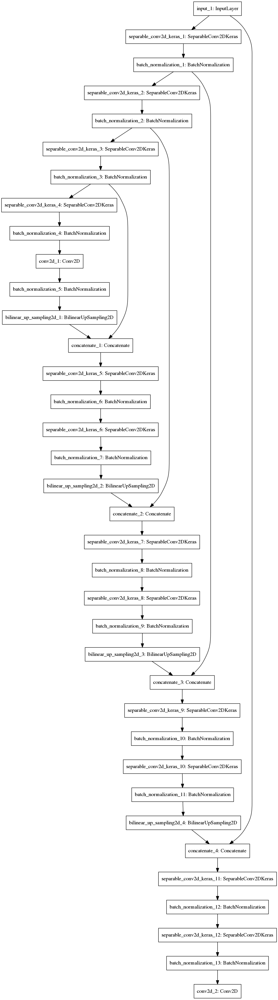

# Project: Follow Me

## Required Steps for a Passing Submission:

1. Clone the repo [here](https://github.com/udacity/RoboND-DeepLearning-Project.git) 
2. Fill out the TODO's
3. Optimize your network and hyper-parameters
4. Train your network and achieve an accuracy of  40% (0.40) using the intersection over union metric
which is `final_grade_score` at the bottom of your notebook
5. Make a brief writeup report summarizing why you made the choices you did in building the network

## [Rubric](https://review.udacity.com/#!/rubrics/1155/view) Points

## Submission:

1. Your `model_training.ipynb` notebook that you have filled out
2. An HTML version of your `model_training.ipynb` notebook
3. Writeup report
4. Your model and weights file in `.h5` file format

---

### [model_training.ipnyb Here](https://github.com/vuvuzella/udacity-robond-term1/blob/master/follow_me_project/RoboND-DeepLearning-Project/code/model_training.ipynb)
### [model_training.html Here](./RoboND-DeepLearning-Project/code/model_training.html)
### [Model and weights config Here](https://github.com/vuvuzella/udacity-robond-term1/blob/master/follow_me_project/RoboND-DeepLearning-Project/data/weights)

## Writeup / README

### Network Architecture
 - A Fully Convolutional Network architecture was used 
 to train the model.

 - Having deeper networks extracts more features from an input image.
  By using convolutional networks, we also lessen the occurrence of overfitting,
  Compared to using Fully Connected Networks.

 - The addition of 1x1 convolutional networks adds more depth, without the
 computational burden of a normal convolutional network.

 The following describes the layers of the network:

   1. Layers
      - Encoder - 4 Encoder blocks that consist of a separable convolution
       layer with bath normalization applied.
      The first encoder block has a depth of 16. The second block has 32.
      The third block has 64 and the 4th block has 128. Each block has 
      a stride of 2, which halves the size of the image for each block. 
      The image dimensions are 10x10 by the time it inters the 1x1 convolution
       layer. The filter size for each encoder block is 3.

      - 1x1 Convolution - 1 convolution block with a filter size of 1, 
      stride of 1 and a depth of 256. 
       
      - Decoder - 4 Decoder blocks. Each Decoder block has an upsampling function 
      that upscales the output from the previous layers. The upsampling
       factor is by 2, doubling the dimension of the input image.
        Each block has a skip connection to an encoder block 
       that has the same size after upsampling. After the skip connection 
       (concatenation), the image in each block then undergoes 2 separable 
       convolution and batch normalization layers with a kernel size of 3 and
       stride of 1. Each decoder block, from the 1x1 convolution block, has the 
       filter size of 3 each, and whose depth sizes are 128, 64, 32 and 16
        respectively.

      - The final decoder layer is then connected to a fully connected layer
       whose output is 3, which then uses a softmax function to produce 
       the probability for each class/output.

      - All separable convolutions have Relu as it's activation function.

      - All layers uses 'same' padding.

Here is a graph of the network architecture:

    

### Hyper Parameter Tuning

  1. Epoch
     - The starting epoch was 10 just to see how the learning rate and the 
     overall initial network architecture performs. When the network was hitting
      around 29-33% IoU, the epoch was then increased using. The final epoch
      is 50.

  2. Learning Rate
     - The learning rate started from 0.001 and was gradually increased as 
      when minimization of loss was quite slow for the given epoch. Finally,
      the learning rate was set to 0.01 for the final epoch, whcih achieved
       the IoU > 40% goal

  3. Batch Size
     - The initial batch size was at 64, when the network was simple, but eventually,
     I had to lower down the batch size as my network got bigger and more deeper to
      avoid out of memory error. Eventually I settled with 25.

  4. Steps per Epoch
     - I have added some additional data, but not much. My total training data
      is 4300. Given my batch size as 25, then each epoch would have 172 steps.
       Hence my steps per epoch value is 172.
  
  5. Validation Steps
     - This was left untouched, even if there were added validation data.
      The value is 50.
  
  6. Workers
     - The number of threads that were allocated for training was left at 
     default value of 2.

### Result

1. Intersection over Union is used to measure the performance of the trained model.
The Final IoU score is calculated as Final IoU divided by normalized true positive.

       Final IoU: 0.55418
       Normalized True Positive: 0.75744
       Final Score: 0.41976 or 41%

Some pictures of Hero detection:

1. Following target

   

2. Patrol without target

   

3. Patrol with target

   

4. Video

   

### Limitations
1. The data that were provided were limited to the people and the surroundings, and 
 a specific hero.
 If new elements in the world needs to be segmented, then additional data with those
  new elements in them must as well be added to the training and validation data.

2. The automation of creating validation data for new objects are crucial to keep this specific workflow. Otherwise, the new data has to be labeled manually.

