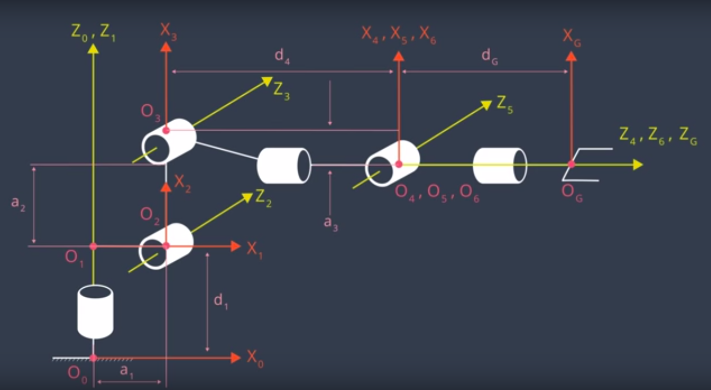

## Project: Kinematics Pick & Place

---

**Steps to complete the project:**  

1. Set up your ROS Workspace.
2. Download or clone the [project repository](https://github.com/udacity/RoboND-Kinematics-Project) into the ***src*** directory of your ROS Workspace.  
3. Experiment with the forward_kinematics environment and get familiar with the robot.
4. Launch in [demo mode](https://classroom.udacity.com/nanodegrees/nd209/parts/7b2fd2d7-e181-401e-977a-6158c77bf816/modules/8855de3f-2897-46c3-a805-628b5ecf045b/lessons/91d017b1-4493-4522-ad52-04a74a01094c/concepts/ae64bb91-e8c4-44c9-adbe-798e8f688193).
5. Perform Kinematic Analysis for the robot following the [project rubric](https://review.udacity.com/#!/rubrics/972/view).
6. Fill in the `IK_server.py` with your Inverse Kinematics code. 

[//]: # (Image References)

[image1]: ./misc_images/misc1.png
[image2]: ./misc_images/misc3.png
[image3]: ./misc_images/misc2.png

## [Rubric](https://review.udacity.com/#!/rubrics/972/view) Points
### Here I will consider the rubric points individually and describe how I addressed each point in my implementation.  

---

### Kinematic Analysis
#### 1. Run the forward_kinematics demo and evaluate the kr210.urdf.xacro file to perform kinematic analysis of Kuka KR210 robot and derive its DH parameters.

### 1.1 Placement of the frames

##### Frame 0

   The z-axis of frame zero (z0) is coincidental with the z1 (z-axis of frame1) by virtue of convention between the base link (w/c frame 0 is) and the first joint connected to the base-link (frame 1). However, the origin will be where x0 and z0 are perpendicular, as shown in fig. 1 labeled as o0 (origin 0). Here, x0 and x1 are not coincidental, because we want to take into account the height, in z0 or z1 direction, of the end-effector (ee)

##### Frame 1
   z1 is coincidental with z0, however, it is skewed with z2 (more info about this on frame 2). z1 is set on the axis of rotation of the revolute joint 1 (the joint whose origin is labeled o1). x1 is parallel to x0 and perpendicular to both z0 and z1.

##### Frame 2

   z2 is set on the axis of rotation of the revolute joint 2 (origin labeled as o2), going "into the page" direction as its positive rotation. z2 is also skewed with z1.

Here is an example of how to include an image in your writeup.

![alt text][image1]

Links | alpha(i-1) | a(i-1) | d(i-1) | theta(i)
--- | --- | --- | --- | ---
0->1 | 0 | 0 | L1 | qi
1->2 | -90 | L2 | 0 | -pi/2 + q2
2->3 | 0 | 0 | 0 | q4
3->4 |  -90 | 0 | 0 | q4
4->5 | 0 | 0 | 0 | 0
5->6 | 0 | 0 | 0 | 0
6->EE | 0 | 0 | 0 | 0

#### 2. Using the DH parameter table you derived earlier, create individual transformation matrices about each joint. In addition, also generate a generalized homogeneous transform between base_link and gripper_link using only end-effector(gripper) pose.

Links | alpha(i-1) | a(i-1) | d(i-1) | theta(i)
--- | --- | --- | --- | ---
0->1 | 0 | 0 | L1 | qi
1->2 | - pi/2 | L2 | 0 | -pi/2 + q2
2->3 | 0 | 0 | 0 | 0
3->4 |  0 | 0 | 0 | 0
4->5 | 0 | 0 | 0 | 0
5->6 | 0 | 0 | 0 | 0
6->EE | 0 | 0 | 0 | 0

#### 3. Decouple Inverse Kinematics problem into Inverse Position Kinematics and inverse Orientation Kinematics; doing so derive the equations to calculate all individual joint angles.

And here's where you can draw out and show your math for the derivation of your theta angles. 

![alt text][image2]

### Project Implementation

#### 1. Fill in the `IK_server.py` file with properly commented python code for calculating Inverse Kinematics based on previously performed Kinematic Analysis. Your code must guide the robot to successfully complete 8/10 pick and place cycles. Briefly discuss the code you implemented and your results. 

Here I'll talk about the code, what techniques I used, what worked and why, where the implementation might fail and how I might improve it if I were going to pursue this project further.  

And just for fun, another example image:
![alt text][image3]

