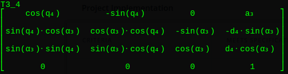
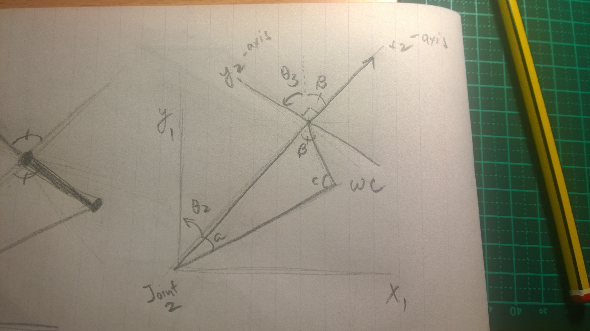
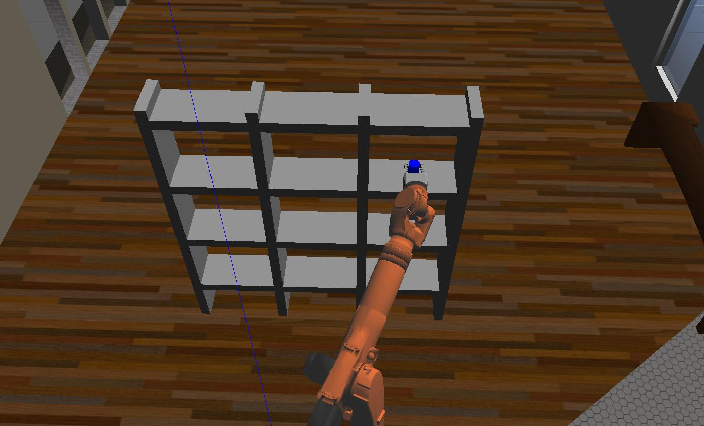

## Project: Kinematics Pick & Place

## [IK_server.py can be found HERE](https://github.com/vuvuzella/udacity-robond-term1/blob/master/pick_and_place/catkin_ws/src/RoboND-Kinematics-Project/kuka_arm/scripts/IK_server.py)

---

**Steps to complete the project:**  


1. Set up your ROS Workspace.
2. Download or clone the [project repository](https://github.com/udacity/RoboND-Kinematics-Project) into the ***src*** directory of your ROS Workspace.  
3. Experiment with the forward_kinematics environment and get familiar with the robot.
4. Launch in [demo mode](https://classroom.udacity.com/nanodegrees/nd209/parts/7b2fd2d7-e181-401e-977a-6158c77bf816/modules/8855de3f-2897-46c3-a805-628b5ecf045b/lessons/91d017b1-4493-4522-ad52-04a74a01094c/concepts/ae64bb91-e8c4-44c9-adbe-798e8f688193).
5. Perform Kinematic Analysis for the robot following the [project rubric](https://review.udacity.com/#!/rubrics/972/view).
6. Fill in the `IK_server.py` with your Inverse Kinematics code. 


[//]: # (Image References)

[image1]: ./misc_images/misc1.png
[image2]: ./misc_images/misc3.png
[image3]: ./misc_images/misc2.png

## [Rubric](https://review.udacity.com/#!/rubrics/972/view) Points

### Here I will consider the rubric points individually and describe how I addressed each point in my implementation.  

---

### Kinematic Analysis
#### 1. Run the forward_kinematics demo and evaluate the kr210.urdf.xacro file to perform kinematic analysis of Kuka KR210 robot and derive its DH parameters.

### A. Placement of the frames


fig A.1

1. Frame 0

   The z-axis of frame zero (z0) is coincidental with the z1 (z-axis of frame1) by virtue of convention between the base link (w/c frame 0 is) and the first joint connected to the base-link (frame 1). However, the origin will be where x0 and z0 are perpendicular, as shown in fig. 1 labeled as o0 (origin 0). Here, x0 and x1 are not coincidental, because we want to take into account the height, in z0 or z1 direction, of the end-effector (ee)

2. Frame 1

   z1 is coincidental with z0, however, it is skewed with z2 (more info about this on frame 2). z1 is set on the axis of rotation of the revolute joint 1 (the joint whose origin is labeled o1). x1 is parallel to x0 and perpendicular to both z0 and z1.

3. Frame 2

   z2 is set on the axis of rotation of the revolute joint 2 (origin labeled as o2), going "into the page" direction as its positive rotation.

4. Frame 3 
    z3-axis of frame3 (Joint 3, a revolute joint) is parallel with z2-axis, pointing into the page as its positive rotation.
    x3-axis is coincidental with x2-axis. The origin of frame 3, o3, has a link length of a2 from the origin of o2, along x2 axis.

5. Frame 4

   Frame4's revolute joint has its z4-axis to be perpendicular with the z3-axis. The direction of z4-axis is to the left, as its positive rotation. Joint4 is part of a Spherical wrist (along with Joint 5 and 6), hence the x4-axis is set at the same intersection point as x5 and x6, making them have a common intersection with z4, z5 and z6.

6. Frame 5

   Frame5's revolute joint has its z5-axis to be pointing into the page as its positive rotation. x5 is perpendicular to z5, intersects z4, z5 and z6 (Spherical wrists are 3 joints intersecting at one common point) and shares a common origin with o4 and o6

7. Frame 6

   Frame6's revolute joint has its z6-axis to be pointing on the left direction, coincidental with z4-axis and intersecting with z5-axis. x6-axis is coincidental with x4 and x5, hence the same origin as o4 and o5.

8. Frame Gripper

   The gripper frame has the same orientation with Frame 6, but translated along the z-axis, from frame6 by a distance of dg, as depicted in fig A.1.

### B. D-H Parameters

Links | alpha(i-1) | a(i-1) | d(i-1) | theta(i)
--- | --- | --- | --- | ---
0->1 | 0 | 0 | d1 | q1
1->2 | -90 | a1 | 0 | -90 + q2
2->3 | 0 | a2 | 0 | q3
3->4 |  -90 | a3 | d4 | q4
4->5 | 90 | 0 | 0 | q5
5->6 | -90 | 0 | 0 | q6
6->EE | 0 | 0 | dG | q7

fig A.2

1. Link 1

   Since z0 is coincidental with z1, there is no difference in angle nor distance in these axes between the base link and joint1.

   On the other hand, we wanted to measure the link offset between link 0 and link 1, which is d1.

      + Link twist alpha0 = 0
      + Link length a0 = 0
      + Link offset d1 = 0.75 (from URDF)
      + Joint angle = theta 1

3. Link 2

   z2 is skewed with z1, hence there is a link length between z1 and z2 along the x1 axis shown as the length a1 in fig. A.1 above. It's DH parameter is defined to be the length a1.

   The angle difference between z2 and z1 on the x1 axis is said to be -90 degrees, since we need to rotate frame1 on the x1 axis by -90 degrees to align z1 to z2.

   The angle difference between x2 and x1 on the z2 axis is said to be the amount of rotation of z2-axis (theta2 or q2 in DH parameter table) plus a fixed offset of -90 degrees, since we need to offset x1 by -90 degrees, in addition to q2, to align x1 with x2

      + Link twist alpha1 = -90 (from fig A.1)
      + Link length a1 = 0.35 (from URDF)
      + Link offset d2 = 0
      + Joint angle q2 = -90 + theta2 (variable value)

4. Link 3

    There is a link length between the z-axes of joint2 and joint3 along the x2-axis, which is defined as a2.
    
    Since z3 and z2 are parallel, there is no link twist.

    Since x3 and x2 are coincidental, there is no link offset. Their joint angle difference changes by theta3

      + Link twist alpha2 = 0
      + Link length a2 = 1.25 (from URDF)
      + Link offset d3 = 0
      + Joint angle q3 = theta3 (variable value)

5. Link 4

    z4 intersects with z3 (diagrammatically it is a skew, but we remove the offset for simpler analysis). Hence, There is a -90 degree in link twist, to align z3 to z4.

    The link length between z4 and z3 is defined by the length a3 in fig. A.1

    Since we made frame4's origin to be coincidental for frame5 and frame6's origins, we consider the link offset between joint3 and joint4 to be the link offset from joint3 to joint5.

      + Link twist alpha3 = -90
      + Link length a3 = -0.54(from URDF)
      + Link offset d4 = 1.500 (from URDF joint 4 + joint 5)
      + Joint angle q4 = theta4 (variable value)

6. Link 5

    z5 intersects with z4, hence we need to rotate frame4 along x4 to align z4 with z5. In doing so, we have a 90 degree link twist.

    There is no difference in link length between z4 and z5 along x4.

    Since we have already accounted for the link offsets from joint3 to joint5 in the link4 analysis, we will not count them again here.

      + Link twist alpha4 = 90
      + Link length a4 = 0
      + Link offset d5 = 0
      + Joint angle q5 = theta5 (variable value)

7. Link 6

   z6 and z5 intersects, hence we need to rotate frame5 along x5 by -90 degrees to align with z6.

   There is no difference in link lengths between z6 and z5 along x5.

   Also, there is no difference in link offsets between x6 and x5 along z6, since they are coincidental axes.

      + Link twist alpha5 = -90
      + Link length a5 = 0
      + Link offset d6 = 0
      + Joint angle q6 = theta5 (variable value)

8. Link 7

    zG and z6 are coincidental axes, so there is no rotation needed for frame6 to align z6 to zG.

    There is also no link length difference in zG and z6 along xG, since the end effector has the same rotation as the joint before it.

    Since end effector frameG is just a translation of frame6, there is difference in xG and x6 along zG, which is defined by dG.

      + Link twist alpha5 = 0
      + Link length a5 = 0
      + Link offset d6 = 0.303 (from URDF)
      + Joint angle q6 = theta5 (variable value)

#### 2. Using the DH parameter table you derived earlier, create individual transformation matrices about each joint. In addition, also generate a generalized homogeneous transform between base_link and gripper_link using only end-effector(gripper) pose.

A. Individual Heterogeneous Transformation Matrices

   A DH transform matrix is defined to be as:

   

   Where as arguments we use alpha_i-1 (link twist), a_i-1 (link length), d_i (link offset) and theta_i (joint angle)

   Each individual DH Heterogenous transformation matrices is defined as the 
   matrix of ```i-1``` multiplied by the matrix of ```i``` where ```i``` is the ith link

   ```T0_1 = htm_i-1 * htm_i```

The following are the individual DH transform matrices of each link
1. Link 0 to Link 1

   

2. Link 1 to 2

   

3. Link 2 to 3

   

4. Link 3 to 4

   

5. Link 4 to 5

   

6. Link 5 to 6

   

7. Link 6 to G

   

8. Link 0 to G

   

9. DH parameter notation and Gazebo URDF discrepancies
   The discrepancy between the DH notation is defined as rotating the position of the end-effector in the Z-axis by 180 degrees and a rotation on the y-axis by -90 degrees.

   

   ```correction_matrix = Rotation_z(180) * Rotation_y(-90)```

   Hence for any given end effector, we must multiply it with the correction matrix

   

   ``` Rotation_zyx_ee * correction_matrix```


#### 3. Decouple Inverse Kinematics problem into Inverse Position Kinematics and inverse Orientation Kinematics; doing so derive the equations to calculate all individual joint angles.

A. Inverse Position

1. Firstly, we calculate for the rotation and position of the wrist center

   + Then we calculate the rotation matrix from the base link to the wrist center, taking into account the correction matrix. The rotation matrix is retrieved from ROS as roll, pitch and yaw by using the quaternion functions.

      ```Rot_wc = Rotation_z(yaw) * Rotation_y(pitch) * Rotation_x(roll) * correction_matrix```

   + In our wrist center calculation, we only need the projection of zG unto z6, since that is the only rotational difference between frame6 and the gripper

      ```ZprojG_6 = correction_matrix[:,2]```

   + Then we multiply the projection of the rotation to the amount of translation along zG, from x6 to xG. The amount of translation is described by dG in our DH-parameters.

      ```translate_diff = dG * ZprojG_6```

   + Then calculate the wrist center position by subtracting the amount of translation from frame6 to the gripper (since there is no rotation grom frame6 to gripper). 
      
      ```wc_pose = ee_pose - translate_diff```

2. theta1 (q1)

   + theta1 can be solved by applying the pythagorean theorem between joint 1 and the wrist center. We use the tangent function since the triangle formed between joint1 and the wrist center have given values for the y and x values (w/c is the wrist center's pose's y and x's). Then we use the inverse of tangent to get theta

      ```theta1 = atan2(wc_pose[1], wc_pose[0])```

3. theta2 (q2) and theta3 (q3)

   

   fig 3.A.1

   + In order to get theta2, we need to find the angles inside the triangle formed by joint2, joint3 and the wrist center.

   + We would use the law of cosines in deriving the angles alpha, Beta and gamma (small case a, b, c in fig 3.A.1). Side A's length is the link offset d4 and side C is the length of link length a2.

   + The length of side B is missing. We can derive its length by projecting the wrist vector unto the xy-plane.

      ```projx = sqrt(wc_pose[0]**2 + wc_pose[1]**2)```

   + We then subtract the lengths link length a1 and link offset d1, to set the vector's magnitude to be from joint 1, instead of from link 0. Then we just use the pythagorean theorem to get the length of side B.

      ```side_b = sqrt((projx-a1)**2 + (wc_pose - d1)**2)```

      ```side_a = d4```

      ```side_c = a2```

   + To find the angles inside the triangle, we now can use the law of cosines

      ```
         angle_a = acos((side_b**2 + side_c**2 - side_a**2)/(2*side_b*side_c))
         angle_b = acos((side_a**2 + side_c**2 - side_b**2)/(2*side_a*side_c))
         angle_c = acos((side_a**2 + side_b**2 - side_c**2)/(2*side_a*side_b))
      ```

   + With the angles derived, theta2 is just 90 minus angle_a, and the remaining angle. The remaining angle is derived by projecting the wrist center pose without a1 and d1, unto the xy plane, then using the resulting vector as the x component of arctangent while the z value of the crist center (without d1) is the x component:

      ```remaining_angle = atan2(pos_wc[2] - d1, projx)```
      ```theta2 = 90 - angle_a - remaining_angle```

   + Theta3 is derived by extending side A, that will create an alternate angle. At the same time, the reference axis for  joint 3 is rotated by the value of theta2. This means that to get the value of theta 3, we just subtract the alternate angle, whose value is equal to angle_b from the previous section. We also take into account the sag angle from joint 3 to joint 5/wrist center. The sag angle is derived below.

   

   ```sag_angle = atan2(1.501**2 - 0.054**2)```

   Where 1.501 is the link length from joint 3 to 5 (our wrist center), 0.054 is the "z-offset" which is negative, from joint 3 to joint 4. So Finally, theta3 is

   ```theta3 = 90 - angle_b + sag_angle```

B. Onverse Orientation Kinematics

1. First off, we need to get the rotation matrix R0_3, which can be be derived by multuplying the heterogenous transform of T0_1, T1_2, and T2_3:

   ```R0_3 = T0_1 * T1_2 * T2_3```

   Note: Since we now have concrete values for theta1, 2 and 3, we can solve for the R0_3 matrix by substituting them and evaulating into R0_3. Hence, R0_3 will now be containg numbers instead of symbols.

2. Then we get the rotation from R3_6, by using the inverse of R0_3, multiplying it by the rotation towards the wrist center that takes into account the offset between the DH-parameters and Gazebo.

   ```R3_6 = R0_3.inv() * Rot_wc```

3. theta4, theta5, theta6

   

   + After getting the rotation from joint3 to 6, we now have a matrix which we can derive the next three angle thetas.

   + For theta4, we choose R3_6[2, 2] and R3_6[0, 2], sin(q5) cancels out, then we multiply by -1 to R3_6[0, 2] to get rid of the negative sign to have:

      ```arctangent(sin(q4)/cos(q4)) => atan2(R3_6[2, 2], -R3_6[0, 2])```

   + For theta5, we see a possible combination of R3_6[0, 2], R3_6[2, 2] and R3_6[1, 2]. First, we use the equation of a unit circle, using R3_6[0, 2] and R3_6[2, 2]:

      ```sqrt(((-sin(q5))**2 * cos(q4)**2) + (sin(q4)**2 * sin(q5)**2))```

      ```sqrt( sin(q5)**2 (cos(q4)**2 + sin(q4)**2) ) ```

      ```y = sin(q5) * sqrt((cos(q4)**2 + sin(q4)**2))```

      `sqrt((cos(q4)**2 + sin(q4)**2))` is an equation of a unit circle, this just becomes 1. Hence `y = sin(q5)`

      Then we use R3_6[1, 2] as the x-parameter for tha arc tangent function

      ```arctangent(sin(q5) / cos(q5)) => atan2(y, R3_6[1, 2])```

   + For theta6, using R3_6[1, 1] and R3_6[1, 0] cancels out sin(q5), then multiply -1 to R3_6[1, 1] to keep values positive.

      ```arctangent(sin(q6) / cos(q6)) => atan2(-R3_6[1, 1], R3_6[1, 0])```

   + Since there are multiple solutions in solving for the angles of an end effector position, we handle it by checking the sin(q5) and perform the necessary sign change to keep numbers positive

      ```
      if sin(theta5) < 0:
            theta4 = atan2(-R3_6[2, 2], R3_6[0, 2])
            theta6 = atan2(R3_6[1, 1], -R3_6[1, 0])
      else:
            theta4 = atan2(R3_6[2, 2], -R3_6[0, 2])
            theta6 = atan2(-R3_6[1, 1], R3_6[1, 0])
      ```

### Project Implementation

#### 1. Fill in the `IK_server.py` file with properly commented python code for calculating Inverse Kinematics based on previously performed Kinematic Analysis. Your code must guide the robot to successfully complete 8/10 pick and place cycles. Briefly discuss the code you implemented and your results. 

   The overall structure of the algorithm is that, for each call to handle_calculate_IK, I would be performing the forward kinematics calculation to generate the hetero-transform matrices from base link to end effector, then for each pose that is received by the function, I would calculate the inverse kinematics to get the theta angles.

   Firstly, the inv("LU") function in `R3_6.inv("LU")` works differently resulting in end effectors not ending in the desired position. To solve this, I used the transpose instead

   Secondly, when running the IK_debug.py, my offset error (end effector) were getting larger for each iteration of the IK loop, BUT NOT for each call to handle_calculate_IK. I realized I did

      R0_3 = R0_3.evalf(subs={q1: theta1...})

   which overwrites the rotation matrix with the evaluated matrix. To fix this, I just assigned the evaluated matrix to another variable. Dont touch the created matrix.

   Another note was that in my DH parameter table, I also included a default value for q1 - q7, which is zero. The result of this changed the output of some evaluations. Instead of putting the default value zero, I put the q1-7 symbolic parameters instead.

   Initial result my implementation (before switching to transpose(), from inv()) was that most of the time I had the end effector facing downwards.

   After changing to transpose(), my end effector offset difference is now consistent/constant, and the end effectors are always ending in/near the desired position. However, During transitions, the arm still experience unneccessary rotations, which makes transitions very time consuming.

   Some pictures of the result of my implementation:

   
   
   
   
   
   
   

