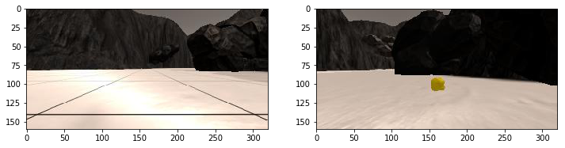
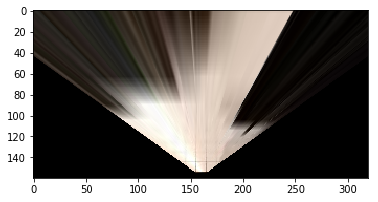
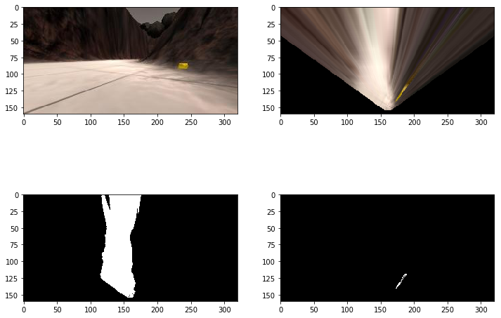
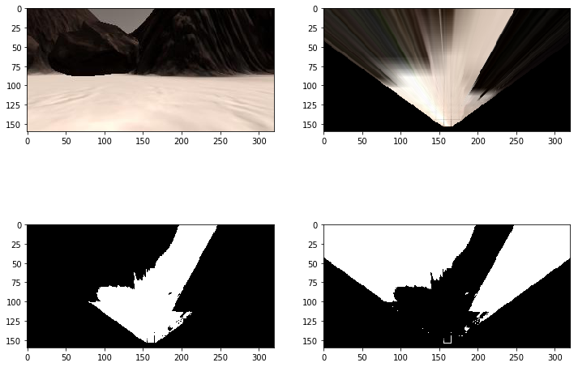

## Project: Search and Sample Return
---

## [Rubric](https://review.udacity.com/#!/rubrics/916/view) Points

### Notebook Analysis

### [Rover Project Test Notebook Found Here](https://github.com/vuvuzella/udacity-robond-term1/blob/master/search_sample_return/Rover_Project_Test_Notebook.ipynb)

#### 1. Describe (and identify where in your code) how you modified or added functions to add obstacle and rock sample identification

The perspect_transform and color_threshold functions were primarily used to implement an image analysis system. 

First, we need to calibrate the perspect_transform to get a desired warped image for analysis by choosing the coordinates that form a trapezoidal box, which when warped, will give a somewhat primitive top-down view of what the robot is seeing. 



In the Perspective Transform section, the coordinates of the source box to be used in the perspect_transform function is in lines 22-25:
```
source_lowerLeft = [14, 140]
source_lowerRight = [301 ,140]
source_upperRight = [200, 96]
source_upperLeft = [118, 96]
```

The destination coordinates were left unchanged as the chosen destination coordinates produces a good top-down image shown below.



Second, we take the output of the perspect_transform function as input to the color_threshold function. The default values for the RGB used is 160,160,160, which were used to detect the navigable terrain.

For detecting rock samples, a new function was created for this with the following code in lines 2-13 of Color thresholding for Rock Samples section:
```
# function that returns the pixels of a golden rock
def color_thresh_gold(img):
    # Create an array of zeros same xy size as img, but single channel
    color_select = np.zeros_like(img[:,:,0])
    above_thresh = (img[:,:,0] > 120) \
                & (img[:,:,0] < 200) \
                & (img[:,:,1] > 120) \
                & (img[:,:,1] < 200) \
                & (img[:,:,2] < 100)

    # Index the array of zeros with the boolean array and set to 1
    color_select[above_thresh] = 1
    # Return the binary image
    return color_select
```
To produce the desired output lines 27-42 was added:
```
sample_fileName = './rock1.jpg'
golden_rock = mpimg.imread(sample_fileName)

transformed = perspect_transform(golden_rock, source, destination)
golden_thresh = color_thresh_gold(transformed)
path_thresh = color_thresh(transformed)

fig = plt.figure(figsize=(12,9))
plt.subplot(222)
plt.imshow(transformed)
plt.subplot(224)
plt.imshow(golden_thresh, cmap = 'gray')
plt.subplot(221)
plt.imshow(golden_rock)
plt.subplot(223)
plt.imshow(path_thresh, cmap = 'gray')


plt.show()
```
which then produces the images necessary for detecting rock samples:



For the obstacles, a separate function is created that uses the original color_thresh function and technically get the negation of it.
An XOR function was used to "negate" the output of color_thresh, in order to retain the black bounderies (the right triangles on the bottom)
of the "negated" color_thresh output. This is seen in line 8 in Color Thesholding for Obstacles section. the whole function is:
```
def color_thresh_obstacles(img):
    # get the non-obstacle color threshold of the same image
    binary_image = color_thresh(img)
    # create a transformed image of ones, which will be used to XOR to the original image        
    black_mask = perspect_transform(np.ones_like(img[:, :, 0]), source, destination)

    # xor the black mask with the binary image 
    binary_image = np.bitwise_xor(binary_image, black_mask)
    # Return the binary image
    return binary_image
```
The output of the color_thresh_obstacles function is as follows, with original, warped, color_thresh, color_thresh_obstacles outputs respectively:



In the last picture, the white part are the obstacles detected fromn the original color_thresh output, which is second to the last image.

2. Describe how you modified the process_image to demonstrate your analysis and how you created a worldmap.

Having defined the source and destination coordinates, a perspective transform of an input image is created in line 14 of process_image function.

From this transformed image, we create the color threshold outputs of navigable terrain, rock samples and obstacles, found in lines 16-18
```
    terrain_thresh = color_thresh(warped)
    rock_thresh = color_thresh_gold(warped)
    obstacle_thresh = color_thresh_obstacles(warped)
```
Then these color thresholds are then converted to x and y pixels based
on our positioning of a "center" of the view, found in lines 20-22 (snipped below). For this we used rover_coords function.
```
    th_xpix, th_ypix = rover_coords(terrain_thresh)
    rt_xpix, rt_ypix = rover_coords(rock_thresh)
    obs_xpix, obs_ypix = rover_coords(obstacle_thresh)
```
After getting the rover-centric coordinates from our threshold images, we need to know its relative polar coordinates, which determines the "angle" of our objects based on a specific center, which is our rover. The lines 25-26 produces the distance and angles numpy array which holds the distance and angle for each pixels, relative to the center.
The to_polar_coords function was used for this.
```
    th_dist, th_angles = to_polar_coords(th_xpix, th_ypix)
    rt_dist, rt_angles = to_polar_coords(rt_xpix, rt_ypix)
    obs_dist, obs_angles = to_polar_coords(obs_xpix, obs_ypix)
```
To map the analyzed images to a top-down ground truth map, we map the rover-centric coords by translating and rotating them. For this we used the pix_to_world function, giving it the rover-centric coords as inputs. Lines 33-37 is where we create the translated and transformed array.
```
    navigable_x_world, navigable_y_world = \
        pix_to_world(th_xpix, th_ypix, xpos, ypos, yaw, data.worldmap.shape[0], 10)
    rock_x_world, rock_y_world = \
        pix_to_world(rt_xpix, rt_ypix, xpos, ypos, yaw, data.worldmap.shape[0], 10)
    obs_x_world, obs_y_world = \
        pix_to_world(obs_xpix, obs_ypix, xpos, ypos, yaw, data.worldmap.shape[0], 10)
```
These values are then mapped to the world map overlaying the ground-truth map in lines 43-45
```
    data.worldmap[navigable_y_world, navigable_x_world, 2] += 1
    data.worldmap[rock_y_world, rock_x_world, 1] += 1
    data.worldmap[obs_y_world, obs_x_world, 0] += 1
```
Finally, the output images of the color threshold functions are added to the output image in lines 70 - 79, with the navigable threshold image on the blue layer, the obstacle threshold on the red layer, and the rock sample threshold on the green layer.
```
    terrain_thresh = terrain_thresh * 255 
    obstacle_thresh = obstacle_thresh * 255
    rock_thresh = rock_thresh * 255
    output_image[img.shape[0]:img.shape[0] + terrain_thresh.shape[0], \
                 data.worldmap.shape[1]:data.worldmap.shape[1] + terrain_thresh.shape[1], 2] = terrain_thresh
    output_image[img.shape[0]:img.shape[0] + terrain_thresh.shape[0], \
                 data.worldmap.shape[1]:data.worldmap.shape[1] + terrain_thresh.shape[1], 0] = obstacle_thresh
    output_image[img.shape[0]:img.shape[0] + terrain_thresh.shape[0], \
                 data.worldmap.shape[1]:data.worldmap.shape[1] + terrain_thresh.shape[1], 1] = rock_thresh
```
The output movie clip from the test notebook:

[](http://www.youtube.com/watch?v=MTjhOVKIJcY)

### Autonomous Navigation and Mapping

### [Search and Sample Return Scripts Found Here](https://github.com/vuvuzella/udacity-robond-term1/tree/master/search_sample_return/ssr_project)

#### 1. perception_step and decision_step functions

The perception step is somewhat similar to the jupyter notebook's process_image function. Basically the algorithm in the perception_step is:

  1. Get the source and destination coordinates for perspecitve transofrm

      * In lines 121 - 145, the source and destination coordinates are defined

  1. Get perspective transform from image inputs

        * In line 147, The perspective transform of the image is created from Rover.image using the source and destination coordinates. 

  2. Get color thresholds from perspective transform images

      * In lines 152 155, the navigable, rock sample and obstacle color thresholds are created 
      * In lines 161-163, These are then put into Rover.vision_image, each on their own RGB layers.

  3. Get the rover-centric coordinates based from the color threshold images

      * In lines 166-168, the rover centric coordinates are created from the color thresholds
      * These are then used to rotate and translate and put into the ground truth map.

  4. Get the polar coordinates from rover-centric coordinates

      * In lines 202-203, The distance and angle from the center in polar coordinate form are derived from the rover-centric form

  5. Translate and rotate the rover-centric coordinate
      
      * In lines 175-178, the rover centric coordinates are then rotated and translated to be mapped to the 200x200 minimap

  6. Map the areas to a top down truth map
      * pix_to_world function rotates and translates the rover centric coordinates to be mapped to the minimap found in lines 175-178
      * These are then placed into the Rover.worldmap in lines 184-196
      * In lines 184-191, conditions are set as to when a legitimate color threshold can be mapped, i.e. when pitch and roll are near zero
      * Also, in line 195, the coordinates of navigable world in the RED layer are set to zero, so as to mark this as "explored", giving the effect of "unshrouding" a "shrouded" but explorable area.

For the decision_step function, I opted for a state-machine design pattern to easily separate the states. Rover.mode was rarely used since a class-based "modes" seems better in handling the scalability of possible states.

The definition of the State, StateMachine and the State derivatives are found in [StateMachine.py](https://github.com/vuvuzella/udacity-robond-term1/blob/master/search_sample_return/ssr_project/StateMachine.py)

So the State class is defined as follows:
```
class State:
    def run (self, inputs):
        assert 0, "run not Implemented"

    def next (self, inputs):
        assert 0, "next not implemented"

    def getAngleFromZero(self, theta=0):
        if theta >= 270:
            return 360 - theta
        else:
            return theta
```

where the functions run() is where the action of a specific state is performed, and the next() is where the next state is decided

The StateMachine class uses the State, and basically it initializes the StateMachine with an initial state, runs the State.run function and gets the next function. Hence, for each decision_step, the StateMachine.run is executed, which performs the State.run and State.next functions

```
class StateMachine:
    def __init__(self, initialState, inputs=None):
        self.currentState = initialState
        self.currentState.run(inputs)

    def run(self, inputs):
        self.currentState.run(inputs)
        self.currentState = self.currentState.next(self.currentState, inputs)
```

#### The states
##### 1. StopState

This state handles the reduction of velocity by increasing the brakes and decreasing the throttle (lines 34-36). This state also detects being stuck at an inclined position (lines 38-44). Its next possible states are: RotateState, ForwardState, StopState

##### 2. ForwardState

This state is handles the throttling and braking, while going forward, making sure the velocity is within the maximum velocity (lines 70-74).
It also decreases decreases the throttle and applies brakes briefly to slow down, if the rover needs to turn as well as limit the instances where the steering needs to change(lines 76-84). This state also detects being stuck in certain areas (lines 90-99). Next possible states are: RockStopState, RotateState, StopState, ForwardState and UnstuckState

##### 3. UnstuckState

This state has been added on the later stages of development, because there seems a need to implement a more complicated way to get the rover unstuck from different situations, hence a state just for unsticking. Currently its role is to route the next state to rotate, but future improvement is to implement different unsticking sequences to get the rover out of the unstuck states.

##### 4. RotateState

Rotate state rotates the rover in complete stop, depending on where the last navigable area was, or currently as a way to get unstuck. In lines 126-139, the decision whether to go right or left depends on the Rover.nav_angles and Rover.nav_last_angle_seen. The next possible states are ForwardState and RotateState

##### 5. RockStopState

This state is the entry state towards the rock rotate, approach and pick sequence. When the rover enters this state, it means it has seen a rock, even though the rock has become not visible in the current view inputs. Basically this state stops the rover, making sure all pitch and roll are at tolerable levels (lines 169-173). Its next possible states are RockRotateState or RockStopStatae. 
##### 6. RockRotateState

This handles rotating the rover when it has seen a rock sample. Lines 183-186 determines which way to rotate depending on the mean rover-centric angle that a rock was last seen. The destination angle is calculated by adding the starting yaw (the yaw where rock was last seen) and the rock's angle (lines 189-194). The rover keeps rotating until the difference between the current yaw and the destination angle is less than 4 (lines 197-199). The next possible states are RockForwardState or RockRotateState

##### 7. RockForwardState

This state handles the steering and velocity maintenance of the rover as it tries to approach the rock. Lines 204-211 maintains the velocity, and lines 213-219 handles steering changes depending on the mean rock angle if it is outside +0.1 and -0.1 range. This state also detects being stuck while approaching a rock (lines 225-231). When the rover is near a sample, it then goes to RockPickState. The next possible states are RockPickState, UnstuckState, or RockForwardState

##### 8. RockPickState

This state handles the picking of the rock after the rover approached it. This state also sets a flag to detect if it is picking up a rock on an inclined (pitch and roll greater than zero) (lines 246-248) so as to resume forward operation when it gets to StopState, distinguishing it from remaining at StopState while pitch and roll are greater than zero (lines 47-53). Next possible states are RockPickState or StopState

In lines 261-263, A RoverSM class is defined, inheriting from StateMachine. Its StateMachine is then initialized with StopState as its default state.

In lines 265 - 274, instances of each states are initialized as constant member variales of the RoverSM class.

Finally, in [decision.py](https://github.com/vuvuzella/udacity-robond-term1/blob/master/search_sample_return/ssr_project/decision.py), MarsRoverSM is an instance of RoverSM class (line 16), and in line 16, MarsRoverSM runs the State.run and State.next, using the Rover object as input

#### Demonstration

The result of the autonomous robot is:
  * 6 Rock samples located
  * 6 rock samples collected
  * Fidelity no less than 60%
  * more than 90% of the ground truth has been mapped

Simulator settings:
  * Screen Resolution: 1024 x 768
  * Frames per second: avg: 10-14 (14fps without screen casting)
  * Graphics Quality: Fastest

Youtube Video 

[](http://www.youtube.com/watch?v=aIpcEGg_O5Y)

